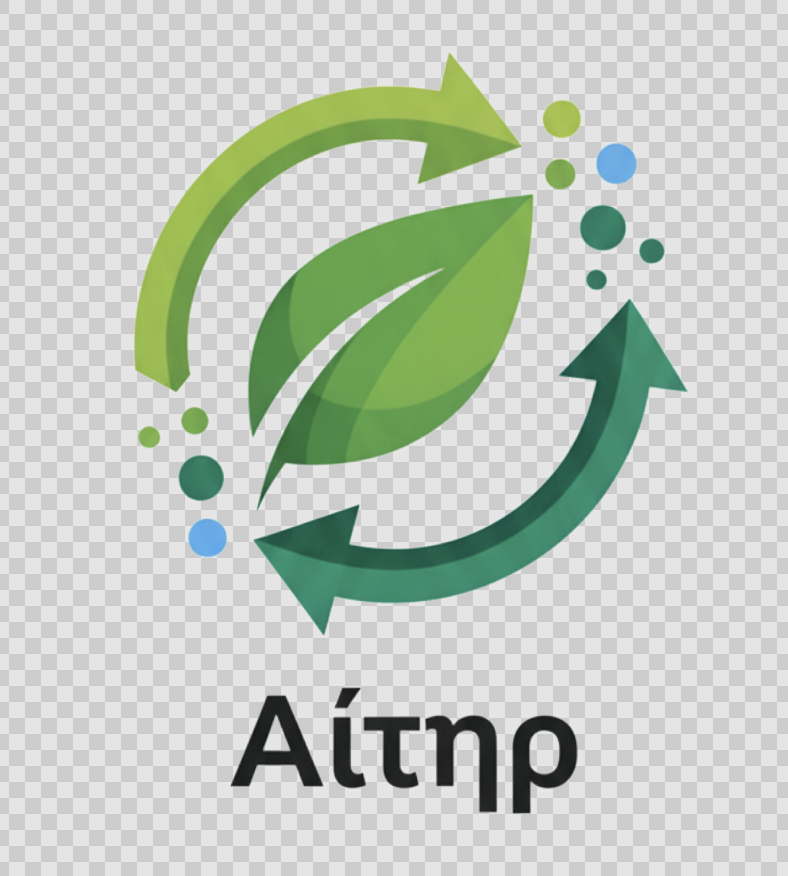

# 🌍 Aether - Carbon Footprint Tracker



**Track • Reduce • Offset Your Carbon Footprint**

Aether is a comprehensive React Native mobile application that helps users track, analyze, and reduce their carbon emissions through intelligent tracking, gamification, and social features.

---

## 📱 Features

### Core Features
- 🔥 **Real-time Carbon Tracking** - Log emissions from transport, food, energy, and shopping
- 📊 **Interactive Dashboard** - Visualize your carbon footprint with dynamic charts
- 🎯 **Daily Goals & Streaks** - Set targets and maintain consistency
- 🏆 **Achievements System** - Unlock badges and earn eco-points
- 👥 **Social Leaderboard** - Compete with friends and community
- 🎉 **Challenges** - Participate in eco-friendly challenges
- 🎁 **Rewards** - Redeem eco-points for gift vouchers
- 🌳 **Carbon Offsets** - Purchase verified carbon credits
- 📍 **Trip Tracking** - Automatic transport emission tracking with GPS
- 🏦 **Bank Integration** - Analyze spending-based carbon footprint (Plaid)

### Technical Features
- 🌓 Dark/Light Theme Support
- 🔄 Real-time Data Synchronization
- 💾 Offline Support with Local Caching
- 🔐 Secure Authentication (Supabase)
- 📈 Advanced Analytics & Insights
- 🎨 Modern, Intuitive UI/UX

---

## 🏗️ Tech Stack

### Frontend
- **Framework**: React Native (Expo SDK 51)
- **Navigation**: React Navigation 6
- **State Management**: Zustand + React Hooks
- **UI Components**: Custom components with Expo Vector Icons
- **Maps**: React Native Maps (Google Maps)
- **Charts**: React Native Chart Kit + SVG
- **Styling**: StyleSheet API with Theme Context

### Backend & Services
- **Database**: Supabase (PostgreSQL)
- **Authentication**: Supabase Auth
- **Real-time**: Supabase Realtime Subscriptions
- **Storage**: Supabase Storage (avatars, receipts, certificates)
- **API Services**:
  - **Climatiq API** - Accurate carbon emission calculations
  - **Plaid API** - Banking transaction analysis
  - **Google Maps API** - Location tracking & routing
  - **OneSignal** - Push notifications

### Developer Tools
- **Package Manager**: npm/yarn
- **Build Tool**: Metro Bundler
- **Environment**: Expo CLI
- **Version Control**: Git

---

## 📁 Project Structure

```
aether-carbon-tracker/
├── assets/                      # Images, fonts, and static files
│   ├── hero-carbon-tracker.jpg
│   ├── logo-transparent.png
│   ├── icon.png
│   └── splash-icon.png
│
├── src/
│   ├── api/                     # API clients and configurations
│   │   ├── supabase.js         # Supabase client setup
│   │   ├── climatiq.js         # Climatiq API integration
│   │   └── plaid.js            # Plaid banking API
│   │
│   ├── components/              # Reusable UI components
│   │   ├── carbon/             # Carbon tracking components
│   │   │   ├── EmissionForm.js
│   │   │   ├── TripTracker.js
│   │   │   └── CategoryBreakdown.js
│   │   ├── social/             # Social features
│   │   │   ├── FriendsList.js
│   │   │   └── LeaderboardItem.js
│   │   └── ui/                 # Generic UI components
│   │       ├── Button.js
│   │       └── Card.js
│   │
│   ├── context/                 # React Context providers
│   │   └── ThemeContext.js     # Dark/Light theme
│   │
│   ├── hooks/                   # Custom React hooks
│   │   ├── useEmissions.js     # Emissions data hook
│   │   └── useLocation.js      # Location tracking hook
│   │
│   ├── navigation/              # Navigation configuration
│   │   ├── AppNavigator.js     # Main navigator
│   │   ├── AuthNavigator.js    # Auth flow
│   │   └── TabNavigator.js     # Bottom tabs
│   │
│   ├── screens/                 # Screen components
│   │   ├── auth/               # Authentication screens
│   │   │   ├── LoginScreen.js
│   │   │   └── RegisterScreen.js
│   │   ├── onboarding/         # Onboarding flow
│   │   │   ├── WelcomeScreen.js
│   │   │   ├── PermissionsScreen.js
│   │   │   └── SetupScreen.js
│   │   └── main/               # Main app screens
│   │       ├── HomeScreen.js
│   │       ├── TrackingScreen.js
│   │       ├── ProfileScreen.js
│   │       ├── LeaderboardScreen.js
│   │       └── ChallengesScreen.js
│   │
│   ├── services/                # Business logic services
│   │   ├── EmissionService.js  # Carbon calculation logic
│   │   ├── EmissionSyncService.js # Real-time sync
│   │   └── NotificationService.js
│   │
│   └── utils/                   # Utility functions
│       ├── calculations.js
│       └── formatters.js
│
├── supabase/                    # Supabase backend configuration
│   ├── migrations/              # Database migrations
│   │   ├── 20250923_*.sql
│   │   ├── 20251014_*.sql
│   │   └── 20251015_*.sql
│   ├── functions/               # Edge functions
│   │   ├── calculate-emissions/
│   │   ├── leaderboard/
│   │   └── weekly-report/
│   └── config.toml              # Supabase config
│
├── App.js                       # Root component
├── package.json                 # Dependencies
├── app.json                     # Expo configuration
├── .env                         # Environment variables
├── .gitignore                   # Git ignore rules
└── README.md                    # This file
```

---

## 🚀 Getting Started

### Prerequisites

- **Node.js** (v18 or higher)
- **npm** or **yarn**
- **Expo CLI**: `npm install -g expo-cli`
- **Expo Go** app on your phone (for testing)
- **Git**

### Installation

1. **Clone the repository**
```bash
git clone https://github.com/yourusername/aether-carbon-tracker.git
cd aether-carbon-tracker
```

2. **Install dependencies**
```bash
npm install
# or
yarn install
```

3. **Set up environment variables**

Create a `.env` file in the root directory:

```env
# Supabase (Backend Database)
SUPABASE_URL=your_supabase_project_url
SUPABASE_ANON_KEY=your_supabase_anon_key

# Climatiq API (Carbon Calculations)
CLIMATIQ_API_KEY=your_climatiq_api_key
EXPO_PUBLIC_CLIMATIQ_API_KEY=your_climatiq_api_key

# Google Maps (Location & Routes)
GOOGLE_MAPS_API_KEY=your_google_maps_api_key

# Plaid (Banking Integration)
PLAID_CLIENT_ID=your_plaid_client_id
PLAID_SECRET=your_plaid_secret
PLAID_PUBLIC_KEY=your_plaid_public_key

# Push Notifications
ONESIGNAL_APP_ID=your_onesignal_app_id
```

4. **Set up Supabase Backend**

Run the migrations in your Supabase SQL editor:

```bash
# Navigate to supabase/migrations/
# Run each migration file in order (by date):
# 1. 20250923195452_fix_uuid_extension.sql
# 2. 20250923195752_create_backend_tables.sql
# 3. ... (continue with all migrations)
```

Or use Supabase CLI:
```bash
supabase db push
```

5. **Start the development server**

```bash
npm start
# or
expo start
```

6. **Run on device/emulator**

- **iOS**: Press `i` in terminal or scan QR code with Camera app
- **Android**: Press `a` in terminal or scan QR code with Expo Go app
- **Web**: Press `w` in terminal

---

## 🔧 Configuration

### Supabase Setup

1. Create a new project at [supabase.com](https://supabase.com)
2. Copy your project URL and anon key
3. Run all migrations from `supabase/migrations/` folder
4. Enable Row Level Security (RLS) on all tables
5. Configure Storage buckets (avatars, receipts, certificates)

### API Keys Setup

#### Climatiq API
1. Sign up at [climatiq.io](https://www.climatiq.io)
2. Generate an API key
3. Add to `.env` file

#### Google Maps API
1. Create project in [Google Cloud Console](https://console.cloud.google.com)
2. Enable Maps SDK for Android/iOS
3. Generate API key
4. Add to `.env` and `app.json`

#### Plaid API (Optional)
1. Sign up at [plaid.com](https://plaid.com)
2. Get sandbox credentials
3. Add to `.env` file

#### OneSignal (Optional)
1. Create app at [onesignal.com](https://onesignal.com)
2. Get App ID
3. Add to `.env` file

---

## 📊 Database Schema

### Core Tables

- **user_profiles** - User information and stats
- **emissions** - Individual emission entries
- **daily_emissions_summary** - Daily aggregated data
- **emission_factors** - Carbon emission factors database
- **achievement_definitions** - Available achievements
- **user_achievements** - Earned achievements
- **challenges** - Available challenges
- **user_challenges** - User challenge progress
- **user_connections** - Friends system
- **notifications** - In-app notifications

### Storage Buckets

- **avatars** - User profile pictures
- **receipts** - Uploaded receipts for carbon tracking
- **certificates** - Carbon offset certificates
- **challenge-images** - Challenge submission photos

---

## 🧪 Testing

### Run Tests
```bash
npm test
```

### Test Database Connection
```javascript
import { testDatabaseConnection } from './src/api/supabase';

const result = await testDatabaseConnection();
console.log(result);
```

### Test Emission Calculation
```javascript
import EmissionService from './src/services/EmissionService';

const service = new EmissionService();
const result = await service.calculateEmission('transport', 'car', 10);
console.log(result);
```

---

## 🐛 Troubleshooting

### Common Issues

**1. Metro Bundler Cache Issues**
```bash
expo start -c
# or
npm start -- --reset-cache
```

**2. Supabase Connection Errors**
- Verify `.env` variables are correct
- Check internet connection
- Ensure Supabase project is active

**3. Location Permissions**
- iOS: Check Info.plist permissions
- Android: Check AndroidManifest.xml permissions
- Request permissions in PermissionsScreen

**4. Weekly Chart Day Mismatch**
- This is fixed in the latest update
- Clear AsyncStorage cache if persists:
```javascript
import AsyncStorage from '@react-native-async-storage/async-storage';
await AsyncStorage.clear();
```

---

## 📱 Building for Production

### iOS

1. **Configure app.json**
```json
{
  "ios": {
    "bundleIdentifier": "com.yourcompany.aether",
    "buildNumber": "1.0.0"
  }
}
```

2. **Build**
```bash
expo build:ios
```

### Android

1. **Configure app.json**
```json
{
  "android": {
    "package": "com.yourcompany.aether",
    "versionCode": 1
  }
}
```

2. **Build**
```bash
expo build:android
```

---

## 🤝 Contributing

We welcome contributions! Please follow these steps:

1. Fork the repository
2. Create a feature branch (`git checkout -b feature/AmazingFeature`)
3. Commit your changes (`git commit -m 'Add some AmazingFeature'`)
4. Push to the branch (`git push origin feature/AmazingFeature`)
5. Open a Pull Request

### Coding Standards

- Use ESLint configuration
- Follow React/React Native best practices
- Write meaningful commit messages
- Add comments for complex logic
- Test before submitting PR

---

---

## 👥 Authors

- Kritgun Singh - *Initial work* - [kritgun-1907](https://github.com/kritgun-1907)

---

## 🙏 Acknowledgments

- **Climatiq** - Carbon emission data
- **Supabase** - Backend infrastructure
- **Expo** - React Native framework
- **React Native Community** - Amazing libraries and support
- **IPCC** - Climate data and research

---

---

## 🗺️ Roadmap

### Version 1.0 (Current)
- ✅ Basic emission tracking
- ✅ User authentication
- ✅ Dashboard with charts
- ✅ Achievements system
- ✅ Friends & leaderboard
- ✅ Dark mode

### Version 1.1 (Upcoming)
- 🔄 AI-powered emission suggestions
- 🔄 Carbon offset marketplace
- 🔄 Corporate accounts
- 🔄 Advanced analytics
- 🔄 Machine learning trip detection
- 🔄 Integration with smart home devices

### Version 2.0 (Future)
- 🔮 Blockchain-based carbon credits
- 🔮 AR carbon visualization
- 🔮 Community challenges
- 🔮 Carbon trading platform
- 🔮 API for third-party apps

---

---

## 🌟 Star the Project

If you find this project helpful, please give it a ⭐️ on GitHub!

---

**Built with ❤️ for a greener planet 🌍**,
